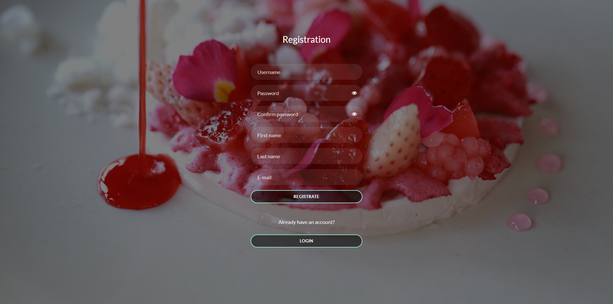
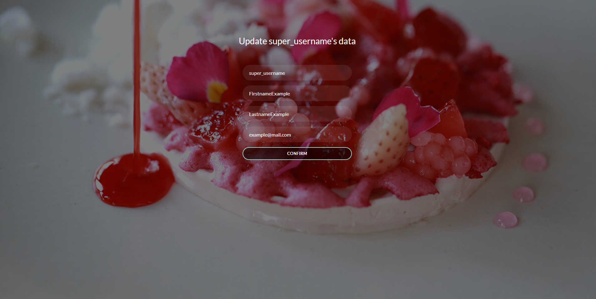

# Cafe "Feeling Happy" project


## Description

Django project for cafe named "Feeling Happy"

## Check it out!

[Cafe project deployed on Render](https://cafe-feeling-happy.onrender.com/)

You can use test user credentials to see more functionality:
- login: `test.user`
- password: `InsequreTestPass123`


## Table of content

- [Features](#features)
- [Installation](#installation)
- [Usage](#usage)
- [Demo](#demo)

## Features

All users:

    - Registration (only as client of cafe, not admin)
    - Authorisation
    - Review and updating current authorisated user's profile info
    - Review dishes in the menu
    - Managing dishes inside order and order creation

Admins:

    - Managing dishes inside menu (create, update, delete)

## Installation
Python3 must be already installed
1. Clone the repository to your local machine:
    ```bash
    git clone https://github.com/OlhaTryhub/cafe-web-site.git
    ```
2. Change into the project directory:
    ```bash
   cd your-repo
    ```
3. Create and activate a virtual environment (optional but recommended):
   ```bash
    python -m venv venv
    venv\Scripts\activate  # On Mac, use: source venv/bin/activate
   ```
4. Install the required dependencies:
    ```bash
    pip install -r requirements.txt 
    ```
5. Apply database migrations:
    ```bash
    python manage.py migrate
    ```
   
## Usage
1. Load data into DB from data.json file (optional):
    ```bash
    python manage.py loaddata data.json
    ```
   For using app as admin you must create your own superuser with command:
    ```bash
    python manage.py createsuperuser
    ```
2. Start your local Django server:
    ```bash
    python manage.py runserver
    ```
3. Open your web browser and navigate to http://127.0.0.1:8000/ to access the application.

## Demo

1. Main page


2. Login


3. Registration



4. User page


5. Updating user's info page



6. Menu
- For unauthenticated user/cafe client


- For admin:


7. Dish detail page:

- For unauthenticated user/cafe client


- For admin


8. Orders list page


9. Oder detail page

- Unconfirmed order


- Confirmed order


